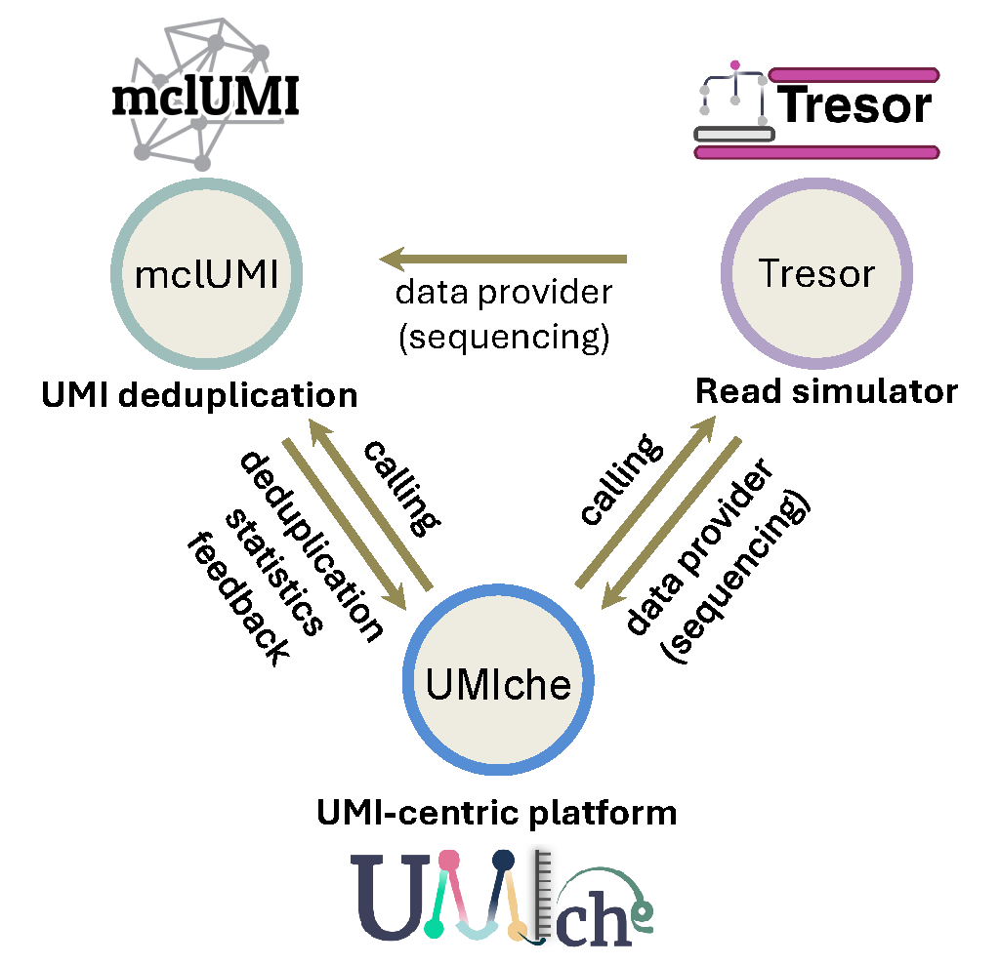



## 🎞️ Video

This video introduces our latest research on UMI-assisted molecular quantification, outlines the core concepts of multi-stage UMI deduplication, and highlights their practical applications.



## 💡 Motivation
Having worked intensively in the field of UMI-based molecular counting for more than 3 years, I've consistently encountered a fundamental limitation: the absence of a standardised, community-wide platform to fairly benchmark and compare UMI deduplication performance. Despite significant progress, researchers have lacked a unified environment offering standard evaluation criteria and consistent, high-quality benchmarking datasets with ground-truth, and evaluation results.

Driven by the vision of addressing this unmet need, I initiated the development of three complementary tools, UMIche, Tresor, and mclUMI. Together, these tools establish an integrated ecosystem designed explicitly to standardise methods, generate reliable benchmarking data, and enable rigorous evaluation of various UMI deduplication techniques. My ultimate goal is to foster a cohesive community where researchers can transparently compare methods, ensure reproducibility, and collectively advance molecular quantification accuracy.

{}
My motivation for establishing this ecosystem is deeply influenced by my prior research experience in the protein residue-contact prediction field where there is CASP that openly evaluate, compare, and drive rapid methodological advancements. I am committed to creating a similar, robust, and transparent evaluation environment in the domain of UMI deduplication and molecular quantification. I aim to contribute to an open and collaborative research community that systematically improves method accuracy, reproducibility, and accelerates innovation across this whole field.
{}

## 📋 Briefing
We built a series of computational methods and tools to enhance molecular quantification accuracy on long-read and short-read data in bulk and single-cell sequencing. They are Tresor, mclUMI, and UMIche, which are earmarked for read simulation, monomer UMI collasping methods, and comprehensive analysis, respectively. 

**Homotrimer UMIs**: A novel UMI design using triplicated nucleotides to robustly correct PCR errors.

**UMIche platform**: An integrated pipeline that systematically evaluates and benchmarks multiple UMI correction methods.

**Tresor simulator**: An efficient sequencing simulator generating high-quality benchmark datasets for single-cell and bulk RNA-seq (short & long reads).

**mclUMI toolkit**: A unified collection of monomer UMI-specific deduplication methods for systematic performance comparison.

## 🛠️ Methods

For **homotrimer UMIs**: Majority voting and set cover optimisation are implemented for accurate PCR artefact removal.

For **UMIche**: Modular pipelines and workflows facilitating comprehensive evaluation of deduplication methods at multiple stages are implemented. Intra- and inter-molecular collapsing concepts are proposed.

For **Tresor**: Novel PCR-tree structure drastically boosts computational efficiency, especially for high PCR-cycle simulations. Tresor can be interrogated for parameters for designing sequencing experiments.

For **mclUMI**: Markov clustering and other diverse graph-based deduplication methods under a consistent benchmarking framework are curated.

The three tools establish a tightly integrated ecosystem, as illustrated in **Fig. 1**.

(i) mclUMI implements automated Markov clustering for traditional monomer UMIs, enhancing molecular counting accuracy. Additionally, it curates a collection of gold-standard UMI deduplication methods for systematic benchmarking.

(ii) Tresor functions as a sequencing data provider, generating customisable simulated reads with known ground truth at both bulk RNA-seq and single-cell RNA-seq levels. These datasets are created from count matrices produced by our internally developed simulator, DeepConvCVAE, which leverages convolutional neural networks (CNNs) within a conditional variational autoencoder (cVAE) architecture. Notably, the DeepConvCVAE framework is integrated as a distinct module within the UMIche platform.

(iii) UMIche offers an extensive suite of computational approaches designed to foster sustainable development and rigorous evaluation of UMI deduplication methods, assisting computational researchers. Concurrently, it supplies valuable analytical insights and optimised experimental parameters, directly benefiting experimental researchers in refining sequencing technologies and experimental designs.

## 📊 Key results

On the UMIche platform, we show the effectiveness of the newly implemented deduplication strategy on simulated reads with ground-truth, significantly improving accuracy under high-error scenarios.

## 🎯 Summary

This integrated ecosystem (_Homotrimer UMIs, UMIche, Tresor, and mclUMI_) provides a standardised, community-focused environment for rigorous evaluation and comparison of UMI-based molecular counting methods. The goal is to enhance accuracy, reproducibility, and innovation in RNA-seq analyses by fostering an open, collaborative research community.

## 🎩 Acknowledgement

I would like to thank my collaborators: [Prof. Adam Cribbs](https://www.ndorms.ox.ac.uk/team/adam-cribbs), [Prof. Stefan Canzar](https://canzarlab.com), and [Dr. Shuang Li](https://canzarlab.com), for their valuable support and contributions to these studies.

💻 Code resources:

1. UMIche: https://github.com/2003100127/umiche

2. Tresor: https://github.com/2003100127/tresor

3. mclUMI: https://github.com/2003100127/mclumi

📜 Documentation:

1. UMIche: https://2003100127.github.io/umiche

2. Tresor: https://2003100127.github.io/tresor

3. mclUMI: https://2003100127.github.io/mclumi

🔗 Explore our papers:

1. UMIche: https://www.biorxiv.org/content/10.1101/2025.03.15.643072v2

2. Tresor: https://www.biorxiv.org/content/10.1101/2025.03.15.643015v2

3. mclUMI: https://www.biorxiv.org/content/10.1101/2025.03.15.643033v2

4. Homotrimer UMI: https://www.nature.com/articles/s41592-024-02168-y