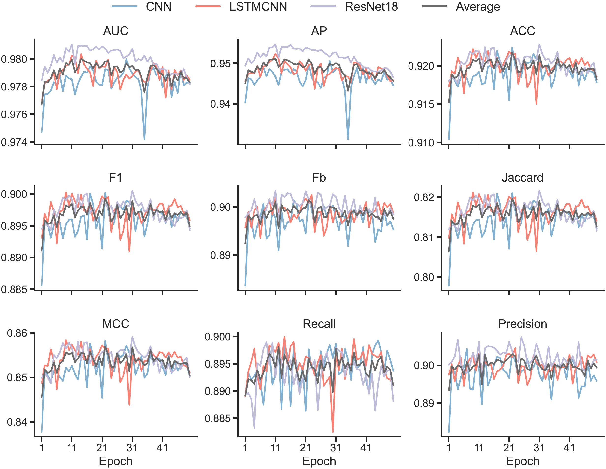
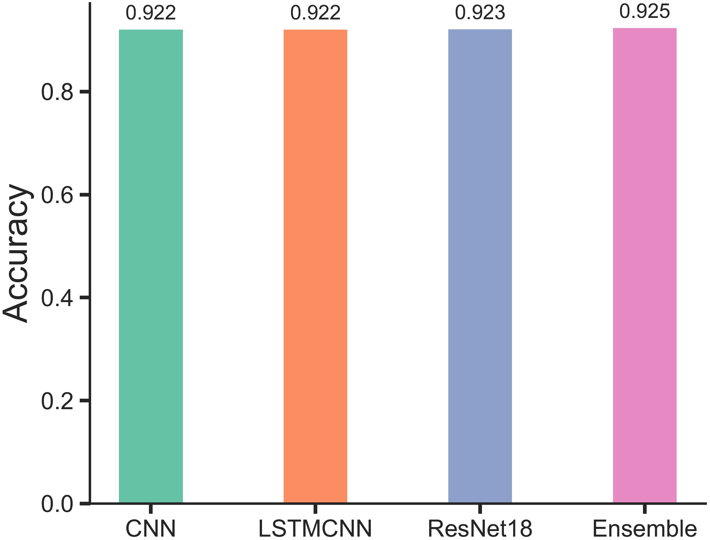
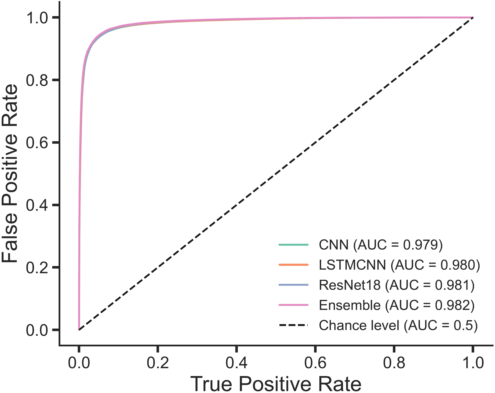

## Prelude

SVlearn is a computational tool for structural variation (SV) genotyping, originally developed using machine learning methods such as Random Forest. While it demonstrated strong predictive capabilities, during the development process we also further explored whether deep learning techniques could enhance its performance. In this post, I would like to briefly present this investigation from a deep learning perspective.

## Behind the paper

https://communities.springernature.com/posts/a-dual-reference-modality-to-effectively-enhance-the-accuracy-of-genotyping-structural-variants-from-short-read-sequencing

## Code source

https://github.com/yangqimeng99/svlearn

## Deep Learning Approach

I used three representative deep learning methods: a convolutional neural network (CNN), a hybrid long short-term memory & CNN model (LSTM-CNN), and a residual network (ResNet). The settings of each method follow those as detailed in [https://doi.org/10.3390/ijms24031878](https://doi.org/10.3390/ijms24031878). Each model was trained. Nine evaluation metrics were used to assess predictive performance, including AUC, AP, Accuracy, Precision, Recall, Matthews Correlation Coefficient (MCC), Jaccard Index, FB-Score, F1-Score

## Results

The dataset used in this study contains tens of thousands of SVs, with features that are highly domain-specific. No signs of overfitting were observed during training (**Figure 1**), indicating effective regularization and data sufficiency.

The best-performing model in SVLearn is random forest, which reaches an accuracy of 0.920. I applied [stack generalisation](https://doi.org/10.1016/S0893-6080(05)80023-1) as an ensemble strategy to several traditional machine learning models, including random forest, logistic regression, naive Bayes, k-nearest neighbors, support vector machine, and gradient boosting, which, however, did not result in a performance gain on the independent test set. 

The best-performing single deep learning model achieved an accuracy of 0.924. Using average ensemble predictions to integrate the three deep learning models, the accuracy improved slightly to 0.925 (**Figure 2**). The ROC curve confirms the stable, robust prediction ability of deep learning (**Figure 3**).

### Conclusions

In contrast, deep learning models achieved slightly higher predictive accuracy, with 0.924 from the best individual model and 0.925 from the ensemble. Although the improvement is marginal (only 0.1%), it demonstrates the capacity of deep learning to extract more complex patterns, while within diminishing returns due to the already strong data foundation.

It is also worth noting that performance variance among deep learning models was minimal, while traditional machine learning models exhibited greater variability, which further highlights the stability and robustness of deep learning in this context.

Overall, the use of machine learning, particularly deep learning for modeling and predicting structural variation data in sheep, has proven to be a successful and meaningful scientific endeavor. The high quality and richness of the dataset played a critical role in ensuring model generalisability and avoiding overfitting. The results suggest that current deep learning models have likely reached the upper performance bound on this dataset, and offer a reliable and consistent predictive framework for SV genotyping tasks.

## Read the paper

https://doi.org/10.1038/s41467-025-57756-z